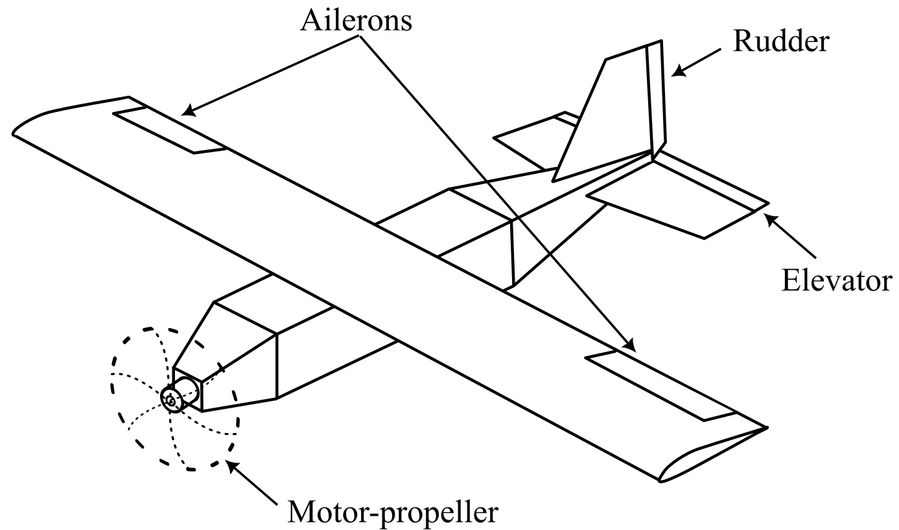
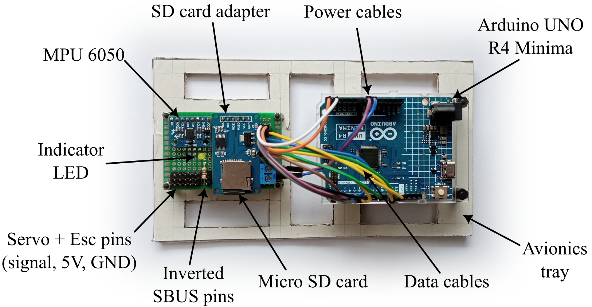

# Arduino-Based UAV Flight Controller

A lightweight, robust, and real-time flight control system designed for small fixed-wing UAVs, implemented on the classic Arduino UNO R3. This project enables fly-by-wire control of the aircraft's attitude, enhancing flight stability and ease of operation under external disturbances.

---

## 🚀 Project Objectives

- Implement a real-time attitude stabilization controller on a small fixed-wing UAV.
- Assist pilots during flight by reducing control workload and improving stability.
- Reject disturbances such as wind gusts using onboard sensor feedback and control algorithms.

<div style="text-align: center;">

</div>

---

## 🧠 System Overview

The system runs on a custom flight computer built around an **Arduino UNO R3** and a dedicated **sensor board**. The board includes:

- IMU sensors for attitude estimation
- SD card module for data logging
- Status LED
- Interfaces for actuator outputs and RC receiver inputs
- Power distribution for onboard electronics

<div style="text-align: center;">

</div>

The Arduino-based controller interprets RC commands, estimates aircraft attitude, and computes control actions to achieve the commanded orientation while maintaining stability.

---

## 📋 Key Features

- ✅ Real-time execution on Arduino hardware
- 🔄 Robust handling of hardware, communication, and software faults
- ⚡ Efficient use of compute resources
- 🧮 Custom implementation of:
  - Algebraic routines
  - Sensor fusion for attitude estimation
  - Attitude control algorithms
- 📡 Reliable communication with peripherals via tested external libraries

---

## 🛠️ Requirements

- **Hardware**:
  - Arduino UNO R3
  - Sensor & peripheral board (IMU, SD card, RC interface, power distribution)
- **Software**:
  - Arduino IDE
  - Arduino libraries (standard and selected external ones for peripheral communication)
- **Programming Language**:
  - C/C++ with Arduino framework

---

## 🧪 Development Approach

- All core logic (algebra, estimation, control) is implemented from scratch.
- Peripheral communication leverages well-tested third-party libraries.
- The system is designed for extendability and high computational efficiency.

---

## 📦 Repository Structure

```
/src           → Source code for attitude estimation and control
/include       → Header files for attitude estimation and control
/docs          → Technical documentation
README.md      → Project overview and setup guide
```

---

## 📈 Future Improvements

- Integration with magnetometer for heading control
- Integration with GPS for navigation-level control
- Path-setting and following capabilities
- Telemetry interface for ground station feedback

## 🙋‍♂️ Contributions

Contributions are welcome. Please open issues or submit pull requests for suggestions, bugs, or enhancements.

---

## 📬 Contact

For technical inquiries, feel free to reach out via the repository’s [Issues](https://github.com/yourusername/your-repo-name/issues) tab.
